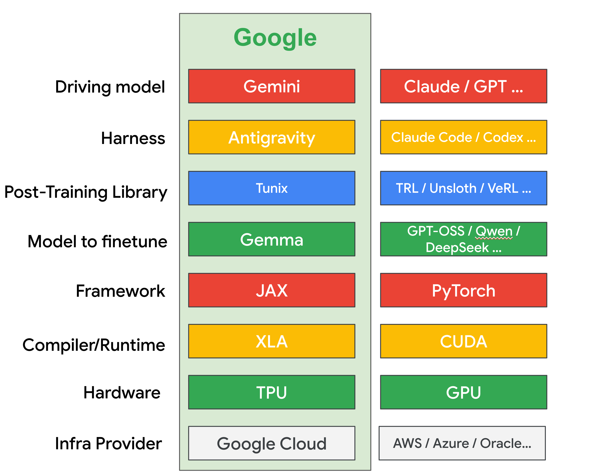
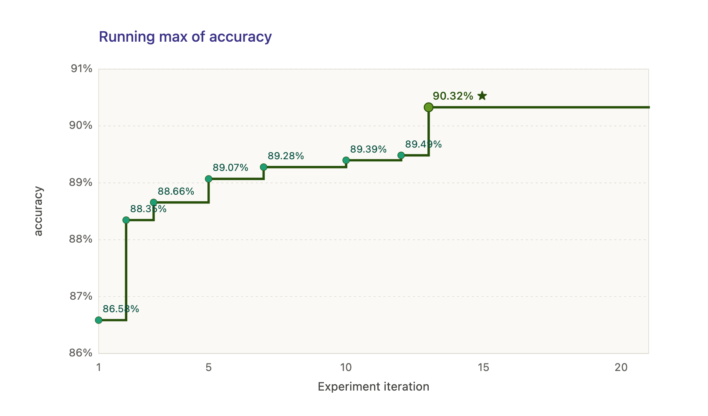
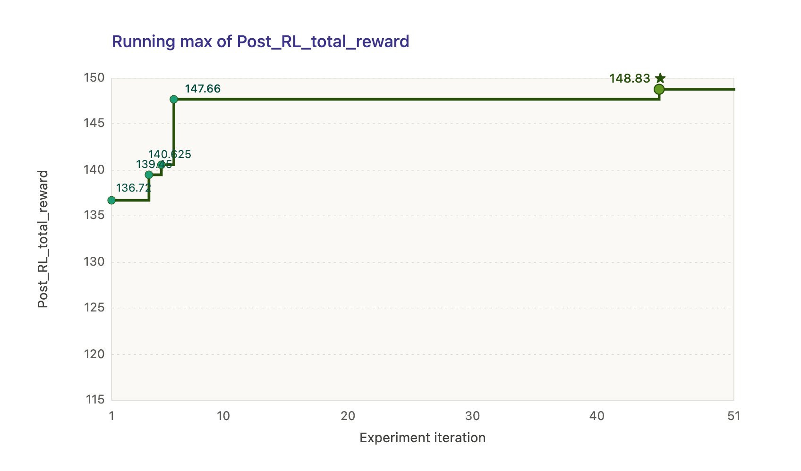

## autoresearch on LLM finetuning

Fun experiment to apply [autoresearch](https://github.com/karpathy/autoresearch) to Tunix+Gemma finetuning, using Antigravity CLI. This is basically using Google's full AI stack.

1. [Tunix finetuning FunctionGemma](https://developers.googleblog.com/easy-functiongemma-finetuning-with-tunix-on-google-tpus/) - 50 experiments, TPU v5e-1, a few hours

2. [Gemma GRPO for math reasoning](https://github.com/google/tunix/blob/main/examples/grpo_gemma.ipynb) - 50 experiments, TPU v6e-1, 2-3 days

### How to run
1. Apply this [workaround](https://gist.github.com/windmaple/a84d140d556d3f09589bd7a5353ad3f3) first, since Antigravity CLI currently crashes on TPU VMs.

2. Switch to one of the 2 folders, start AGY CLI (Gemini 3.6 Flash high) and then do `@program.md`.