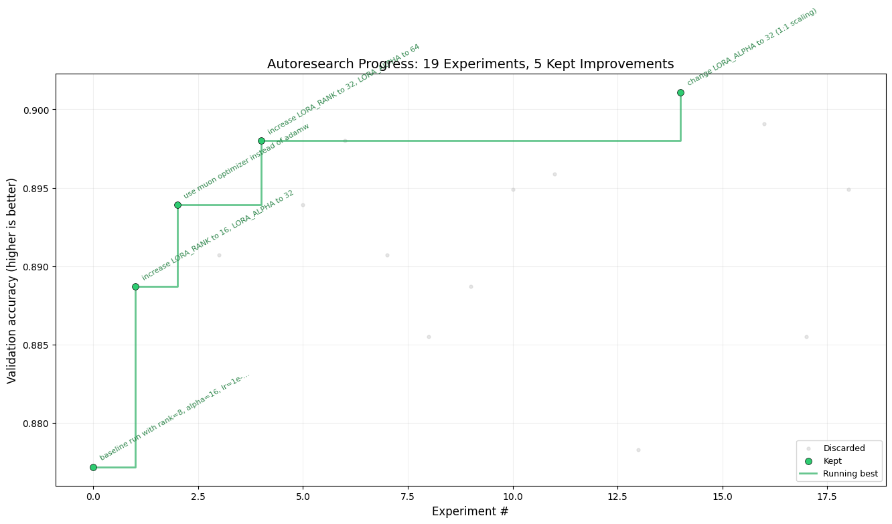
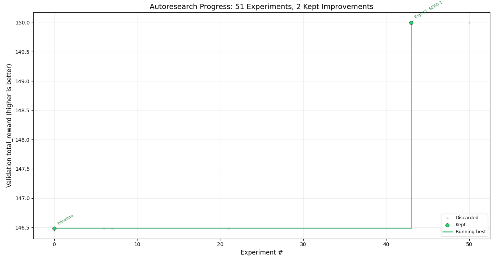

## autoresearch on FunctionGemma finetuning

Fun experiment to apply Karpathy's autoresearch to Tunix finetuning, using Gemini CLI.

[Tunix finetuning FunctionGemma](https://developers.googleblog.com/easy-functiongemma-finetuning-with-tunix-on-google-tpus/)

GRPO Gemma1B is kind of working, but Gemini 3.1 Pro only find a single improvement after 50 runs

